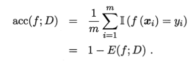
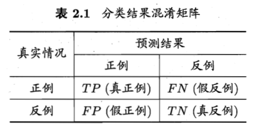
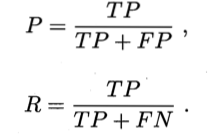
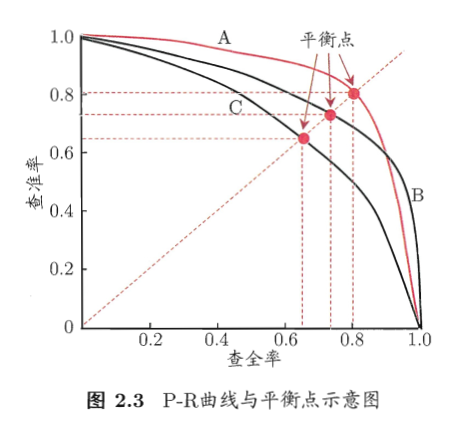
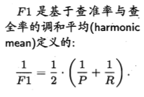
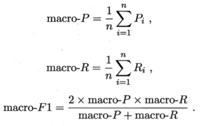
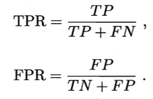
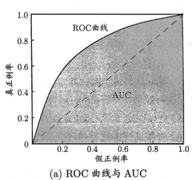
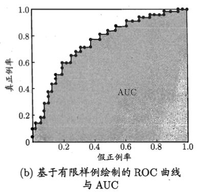
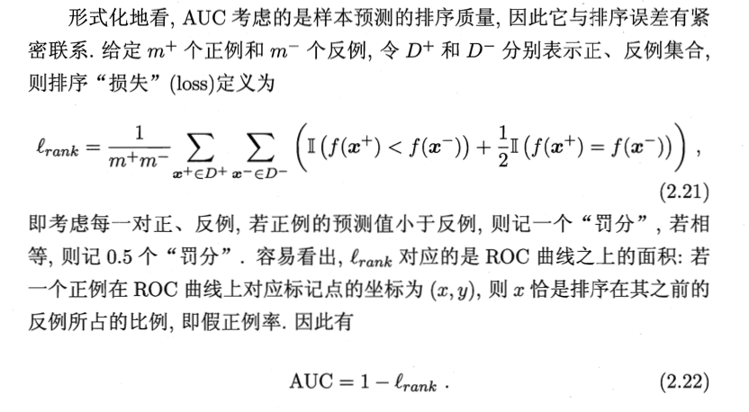

# 性能度量
性能度量是评估一个模型（神经网络模型或者其他机器学习数学模型）的好坏（泛化能力），我们有各种各样的评价标准，不同的评价标准度量出来的模型好坏程度不一样，因此需要根据不同的任务选择度量方法！

## 回归任务的性能度量方法
### 均方误差（MSE）：
常用于回归任务的性能评估，就是小学还是初中就学过的方差计算：

以上是离散点的方差计算，更一般的在连续变量上，计算公式为：

D为数据分布，p(x)是为概率密度函数

---
## 分类任务中的性能度量方法
### 错误率（Error）与精度（Accuracy）：
适用于二分类和多分类任务，错误率指模型分类错误的样本占总样本的比例，精度指分类正确的样本占总样本的比例，因此错误率和精度相加得1。

错误率的计算公式为：

则精度的计算公式为：

更一般的，对于服从分布为D的，概率密度函数为p(x)的数据，其错误率计算方式为：

精度计算公式为：

其实就是将1/m换成了p(x)

### 查准率与查全率：

在二分类任务中，查准率（Precision）是指，在挑出来的西瓜中有多少比例是好瓜（预测为正例的结果中，有多少比例是真正的正例），查全率（Recall）是指在所有好瓜中挑出来了多少比例（在所有真正的正例中，预测为正例的占多少比例）

查准率P和查全率R的计算公式为：

查准率与查全率通常是矛盾的，例如当我们只选择概率最高的样本，那么此时由于只预测了这一个样本，并预测正确的概率最高，那么其查准率就为1/1=1，但是查全率此时就1/n，n为所有样本中正例的数量，此时查全率就极低，因此想出了一种办法来平衡查准率和查全率：

1.将所有样本都预测一遍，计算出每个样本为正例的概率

2.按照概率从大到小将所有样本排序

3.从排序好的样本中，从前往后逐个添加进计算集合中并计算一次此时计算集合中的查准率和查全率，直到添完所有的样本

4.令查全率R为横坐标，查准率P为纵坐标，在3中，每添加一个样本，计算一次R和P，在坐标系上画一个点，最终得到P-R图像

图中A模型的曲线包住了C模型的曲线，则我们认为A模型优于C模型，而A和B是交叉的，因此AB难以评判，图中横纵坐标相等的点叫平衡点（Break-Event Point），如模型A的平衡点高于模型C的平衡点，则能认为A优于C。

但是利用平衡点来判断多个模型的优劣实在太简陋了，因此更常用的评判标准是F1值：
 

在不同的任务中，我们对查准率和查全率的偏向不同，有的任务需要更加精准的判断以免错判（比如把你判断成猴子了你也会不舒服吧），而有的任务需要全面的判断以免有漏网之鱼（宁可错杀一千，不可放过一个），因此一般的使用加权F1来计算会更好：

当权重贝塔小于1时，明显分母上P的比例就变小了，此时偏向于查全率（杀错不放过），当权重大于1时，明显P的比例就变大了，此时偏向于查准率，当权重等于1时，就是之前的调和平均。

当我们有很多个混淆矩阵时，我们可以分别计算出每个混淆矩阵的P，R，F1值，然后取平均，这样就可以得到宏查准率，宏查全率，宏F1：

也可以先把所有混淆举证的TP，TN，FP，FN算平均，这样就可以得到微P，微R，微F1:

### ROC和AUC：

在一般的分类任务中，学习模型会给出0-1的概率值判断该样本为正例的概率，一般的我们会将概率值>0.5的样本归为正例，<0.5的样本归为反例，但是当我们更加注重查准率时，完全可以将该阈值提高到0.6或0.7等，而当我们更加注重查全率时，可以将阈值降低点。

因此按照预测概率将样本从大到小排序后，选取一个截断点（概率阈值）大大影响了该模型的泛化能力，而ROC（受试者工作特征 Receiver Operating Characteristic）曲线就是做个工作的！

与P-R曲线一样，按照P-R的步骤，此时计算的不再是P，P两个值，而是真正例率（TPR）和假正例率（FPR）的这两个值

可以发现，真正例率和召回率的公式一模一样。

上图给出了一个ROC曲线示例，对角虚线表示了随机猜想模型，点（0，1）左上角点表示了将所有正例排在了所有反例之前的理想情况。

但是实际情况是我们只有有限个样本，因此画出来的图像是折线：

画图的方式为：

1.按照预测概率从大到小依次排序

2.将阈值设为1，此时所有样本均被判断为反例，则计算得到点（0，0）

3.依次将阈值设为排序样本的概率值，即按顺序将样本判为正例，设上一个点的坐标为（x，y），若当前判断样本为真正例，则当前坐标点为（x，y+整体样本中一个正例占所有正例的比例），若为假正例，则当前坐标点为（x+整体样本中一个反例占所有反例的比例，y）

4.连接各点得到图像

与P-R图类似，若A模型的ROC图包住了B模型的，则可认为A优于B，若是交叉，则可以比较图中阴影面积的大小，即比较AUC（Area Under ROC Curve）。

图中AUC计算公式为：

 

 

