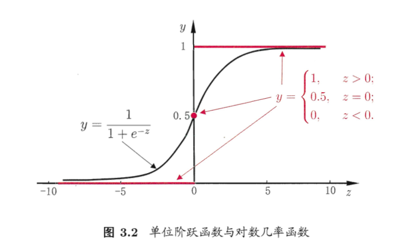

# 第三章线性模型

## 3.1基本形式

给定含有d个属性的自变量$\mathbf{x}=(x_1;x_2;x_3;\cdots;x_d)$，线性模型$f(\bf{x})$的目的是通过该自变量预测，即：
$$
f(\mathbf{x})=w_1x_1+w_2x_2+\cdots+w_dx_d+b
$$
一般向量形式是：
$$
f(\mathbf{x})=\mathbf{w^Tx} + b
$$
其中$\mathbf{w}=(w_1;w_2;\cdots;w_d)$和$b$分别叫做权重和偏置，通过学习得到这两个量后，该线性模型就能确定下来。

## 3.2线性回归

给出数据集$D=\left\{\left(\boldsymbol{x}_{1}, y_{1}\right),\left(\boldsymbol{x}_{2}, y_{2}\right), \ldots,\left(\boldsymbol{x}_{m}, y_{m}\right)\right\}$，该数据集中包含m个样本，那么如何通过该数据集学的线性模型$f(\mathbf{x})$呢，即：
$$
f\left(x_{i}\right) = wx_i + b \simeq y_{i}
$$
而要确定w和b，显然重点在于衡量$f(x_i)$和$y_i$的差距，因此我们可以使用均方误差（MSE）来衡量该差距，因此我们构造出了
$$
\begin{aligned}
Error &=\frac{1}{m}\sum_1^m(f(x_i)-y_i)^2 \\
&=\frac{1}{m}\sum_1^m(wx_i+b-y_i)^2
\end{aligned}
$$
凡是基于均方误差来最小化求解方程的方法都叫做“最小二乘法”。

下一步我们就该最小化以上方程：
$$
\begin{aligned}
\left(w^{*}, b^{*}\right) &=\underset{(w, b)}{\arg \min } \sum_{i=1}^{m}\left(f\left(x_{i}\right)-y_{i}\right)^{2} \\
&=\underset{(w, b)}{\arg \min } \sum_{i=1}^{m}\left(y_{i}-w x_{i}-b\right)^{2}
\end{aligned}
$$
最终得到的$w^*$和$b^*$就能确定该线性模型。

而至于最小化的过程，那当然是将w和b都当作未知量，分别利用以上方程求偏导:
$$
\begin{aligned}
\frac{\partial E_{(w, b)}}{\partial w}&=2\left(w \sum_{i=1}^{m} x_{i}^{2}-\sum_{i=1}^{m}\left(y_{i}-b\right) x_{i}\right)
\\
\frac{\partial E_{(w, b)}}{\partial b}&=2\left(m b-\sum_{i=1}^{m}\left(y_{i}-w x_{i}\right)\right)
\end{aligned}
$$
然后再分别令两个偏导数都等于0，分别解出w和b即可：
$$
\begin{aligned}
w&=\frac{\sum_{i=1}^{m} y_{i}\left(x_{i}-\bar{x}\right)}{\sum_{i=1}^{m} x_{i}^{2}-\frac{1}{m}\left(\sum_{i=1}^{m} x_{i}\right)^{2}}
\\
b&=\frac{1}{m} \sum_{i=1}^{m}\left(y_{i}-w x_{i}\right)
\end{aligned}
$$
其中$\bar{x}=\frac{1}{m} \sum_{i=1}^{m} x_{i}$是$x$的均值，以上公式推导过程最好自己能够推导一遍，加深理解。

当我们的输入$\mathbf{x}$包含d个属性时，即$\mathbf{x}=(x_1;x_2;x_3;\cdots;x_d)$，此时我们需要学得：
$$
f\left(\boldsymbol{x}_{i}\right)=\boldsymbol{w}^{\mathrm{T}} \boldsymbol{x}_{i}+b, \text { 使得 } f\left(\boldsymbol{x}_{i}\right) \simeq y_{i}
$$
此称为“多元线性回归”。

## 3.3对数几率回归

当我们需要进行分类任务时，利用之前的线性回归，将其再包装一层函数，将其改变成非线性函数即可。

考虑二分类任务，简单使用阶跃函数包装线性模型是最方便的，大于0的为1，小于0的为0，但是阶跃函数不是单调可微的，这样我们难以训练，因此考虑使用对数几率函数：
$$
y=\frac{1}{1+e^{-z}}
$$
其中z是之前的线性回归模型。

单位阶跃函数和对数几率函数如下图：

